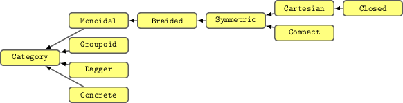
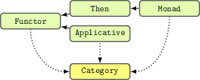
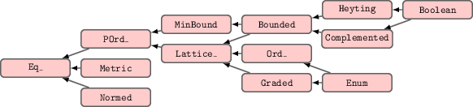
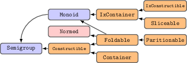

# SubHask 

SubHask is a radical rewrite of the Haskell [Prelude](https://www.haskell.org/onlinereport/standard-prelude.html).
The goal is to make numerical computing in Haskell *fun* and *fast*.
The main idea is to use a type safe interface for programming in arbitrary subcategories of [Hask](https://wiki.haskell.org/Hask).
For example, the category [Vect](http://ncatlab.org/nlab/show/Vect) of linear functions is a subcategory of Hask, and SubHask exploits this fact to give a nice interface for linear algebra.
To achieve this goal, almost every class hierarchy is redefined to be more general.

<!--
Haskell is the most fun language I've ever used,
but writing numeric applications in standard Haskell sucks.
The Prelude provides the wrong abstractions for serious number crunching.
This lack of unifying abstraction means the ecosystem is fragmented;
every library redefines its own abstractions, and these abstractions are not general enough for other libraries to reuse.
I spent all my time writing plumbing between these libraries, which is error prone and soul sucking.
SubHask removes the need for this plumbing.
The interface still needs a bit of polish in places,
but overall SubHask lets me ignore the boring details and focus on getting the math correct.
For me, it's making numeric Haskell programming as fun as non-numeric Haskell :)
-->

SubHask is a work in progress.
This README is intended to be a "quick start guide" to get you familiar with the current status and major differences from standard Haskell.

### Table of contents:

* [Installing](#installing)
* [Examples](/examples)
    * [The category of polynomials](examples/example0001-polynomials.lhs)
    * [Sets are monads in the category `OrdHask` and `Mon`](examples/example0002-monad-instances-for-set.lhs)
    * [The category `(+>)` and linear algebra](examples/example0003-linear-algebra.lhs)
* [New class hierarchies](#new-class-hierarchies)
    * [The category hierarchy](#category-hierarchy)
    * [The functor hierarchy](#functor-hierarchy)
    * [The container hierarchy](#container-hierarchy)
    * [The comparison hierarchy](#comparison-hierarchy)
    * [The numeric hierarchy](#numeric-hierarchy)
* [Automated testing](#automated-testing)
* [Limitations](#limitations)

## Installing

SubHask depends on:

1. GHC >= 7.10.
You can download the latest version of GHC [here](https://www.haskell.org/ghc/download).

1. llvm >= 3.5, llvm < 3.6.
To install on Linux or Mac, run the following commands:

    ```
    $ wget http://llvm.org/releases/3.5.2/llvm-3.5.2.src.tar.xz
    $ tar -xf llvm-3.5.2.src.tar.xz
    $ cd llvm-3.5.2.src
    $ mkdir build
    $ cd build
    $ cmake ..
    $ make -j5
    $ sudo make install
    ```

1. Any version of BLAS and LAPACK.

How to install these packages varies for different operating systems.
For Debian/Ubuntu systems, you can install them using:

    ```
    $ sudo apt-get install libblas-dev liblapack-dev
    ```

For macOS, they are preinstalled as part of the [Accelerate Framework](https://developer.apple.com/legacy/library/documentation/Darwin/Reference/ManPages/man7/Accelerate.7.html).

The easiest way to build and try Subhask is to clone the repo

    git clone https://github.com/mikeizbicki/subhask
    cd subhask

and use stack to build. eg

    stack test --bench

will build the project, run the tests, and run the benchmark.

## Examples

See the [examples](/examples) folder for the literate haskell files.

## New Class Hierarchies

### Category Hierarchy

The modified category hierarchy closely follows the presentation in the [Rosetta Stone paper](http://math.ucr.edu/home/baez/rosetta.pdf).

The image below shows the category hierarchy:

<p align="center"></p>

Important points:

1. Intuitively, `Concrete` categories are functions that have been annotated with special properties.
    More formally, a `Concrete` category is one that is a subtype of `(->)`.
    Subtyping is not a builtin feature of the Haskell language, but we simulate subtyping using the class `<:`.
    See the documentation in [SubHask.SubType](/src/SubHask/SubType.hs) for more details.

1. SubHask contains implementations of both categories and what I call "category transformers."
A category transformer creates a type corresponding to a subcategory in the original category.
For example, we can use the category transformer `MonT :: (* -> * -> *) -> * -> * -> *` to construct the category `MonT (->) :: * -> * -> *`, which corresponds to the category of monotonic functions.
See the [SubHask.Category.Trans.Monotonic](/src/SubHask/Category/Trans/Monotonic.hs) module for details.

    The categories can be found in the `SubHask.Category.*` modules,
    and transformers can be found in`SubHask.Category.Trans.*` modules.
    The design of these transformers roughly follows that of the [mtl library](https://hackage.haskell.org/package/mtl) to allow for composition of transformers.

1. I have removed the `Arrow` hierarchy in favor of a more principled approach.
Some of `Arrow`'s functionality has also been removed since I've never found a use for it,
but it will probably be added at a future point as SubHask matures.

### Functor hierarchy

In the standard Prelude, the `Functor` type class corresponds to "endofunctors on the category Hask".
SubHask generalizes this definition to endofunctors on any category:

```
class Category cat => Functor cat f where
    fmap :: cat a b -> cat (f a) (f b)
```

The image below shows the functor hierarchy:

<p align="center"></p>

The dashed lines above mean that the `Functor`, `Applicative`, and `Monad` instances can depend on a category.

Important points:

1. This modified functor hierarchy gives us a lot of power.
For example, we can finally make `Set` an instance of `Monad`!
Actually, `Set` is an instance of `Monad` in two separate categories:
the category of functions with an `Ord` constraint (i.e. `OrdHask`)
and the category of monotonic functions (i.e. `MonT (->)` mentioned above).
Semantically, both have the same meaning, but the monotonic `fmap` runs faster.

1. We've introduced a new class `Then` that does not depend on the `Category`.
This class is a hack to make monads play nice with do notation;
it's only member function is the `(>>)` operator.
There's probably something deep going on here that I'm just not aware of.

1. Notice that the `Applicative` class is not a super class of `Monad`.
While it's true that every `Monad` in `Hask` is also an `Applicative`,
this does not appear to be true for arbitrary categories.
At least it's definitely not true given the current definition of the `Category` class I've defined.
I'm not sure if that's a limitation of my design or something more fundamental.

1. The functor hierarchy is much smaller than the functor hierarchy available with base.
I haven't included Prelude classes like `Alternative`, and I haven't included all of the classes Edward Kmett is famous for (see e.g. [category-extras](http://hackage.haskell.org/package/category-extras)).
All of these class can in principle be extended to the more generic setting of SubHask, I just haven't gotten around to it yet.

    [Lens](http://hackage.haskell.org/package/lens) is the most famous package that uses the extended funtor hierarchy.
    As-is, the current version of lens is fully compatible with SubHask;
    however, the [container hierarchy](#container-hierarchy) below obviates the need for most of the fancy lenses.
    Eventually, I'd like to implement lenses in arbitrary categories.
    For example, you could use a monotonic lens to guantee updates to a data structure are monotonic.
    I haven't done very much work on this yet though.

    Another interesting category theoretic Kmett library is [hask](https://hackage.haskell.org/package/hask).
    Everything in that library can be translated to SubHask, but that's not something I've done yet.

### Comparison Hierarchy

SubHask's comparison hierarchy is significantly more complicated than Prelude's.
It is directly inspired by [order theory](https://en.wikipedia.org/wiki/Order_theory) and [non-classical logic](https://en.wikipedia.org/wiki/Non-classical_logic).

The hierarchy is shown in the following image:

<p align="center"></p>

Important points:

1.  A type in SubHask can be compared using non-classical logics.
    Consider the type of equality comparison:
    ```
    (==) :: Eq_ a => a -> a -> Logic a
    ```
    The return value is given by the type family `Logic a`, which specifies the logical system used on the type `a`.

    For most types, `Logic a` will be `Bool`, and everything will behave as you would expect.
    But this more general type lets us define equality on types for which classical equality is either uncomputable, undefined, or not what we actually want.

    Consider the case of functions.
    Classical equality over functions is uncomputable.
    But in SubHask, we define:
    ```
    type instance Logic (a -> b) = a -> Logic b

    class Eq_ b => Eq_ (a -> b) where
        (f==g) a = f a == g a
    ```
    This non-classical logic simplifies many situations.
    For example, we can use the `(&&)` and `(||)` operators on functions:
    ```
    ghci> filter ( (>='c') && (<'f') || (=='q') ) ['a'..'z']
    "cdeq"
    ```

    I have a hunch this will make for a nice probabalistic programming interface,
    but I could turn out completely wrong.

* The `Eq` type class corresponds to the idea of [equivalence classes](https://en.wikipedia.org/wiki/Equivalence_class) in algebra.
There are much more general notions of equality that are well studied, e.g. [tolerance classes](https://en.wikipedia.org/wiki/Near_sets#Tolerance_classes_and_preclasses).
I've been careful to design the existing comparison hierarchy so that it will be easy to add these more general notions of equality at some point in the future.

### Container Hierarchy

SubHask's container hierarchy is inspired by the [mono-traversable](http://hackage.haskell.org/package/mono-traversable) and [classy-prelude](https://hackage.haskell.org/package/classy-prelude) packages.
These packages use type families to make the standard type classes applicable to more data types.
For example, they can make `ByteString` an instance of `Foldable`, whereas the Prelude classes cannot.
This makes code *look* more generic, but unfortunately these packages' classes come with no laws.
In contrast, SubHask provides a clear and useful set of laws for each type class.

The container laws are closely related to the axioms of set theory.
The main two differences are that SubHask's laws handle the case of non-commutative containers but don't bother with infinitely sized containers.
See the [automated-testing](#automated-testing) section below for more details on class laws.

The container hierarchy is shown in the image below:

<p align="center"></p>

Important points about containers:

* The container hierarchy is general enough to support very weird containers.
Containers like [HyperLogLog](/src/SubHask/Compatibility/HyperLogLog.hs)s and [BloomFilter](/src/SubHask/Compatibility/BloomFilter.hs)s fit nicely in the hierarchy and don't need to implement their own non-standard interface.
This makes generic programming much easier.

* SubHask makes a clear distinction between vectors and arrays.
A vector in SubHask is not a generic container (like it is in the C++ STL or Haskell's [vector](https://hackage.haskell.org/package/vector) package).
That's what arrays are for.
Vectors are elements of a vector space and subject to an entirely different set of laws (discussed in the [numeric hierarchy](#numeric-hierarchy) section below).
The array types can be found in the [SubHask.Algebra.Array](/src/SubHask/Algebra/Array.hs) module, and internally use the vector package for its nice fusion abilities.

    One nice result of the vector/array distinction is that it becomes easy to make unboxed arrays of unboxed vectors.
    Unboxing the vectors within the array is crucial for high performance numeric operations, but it is not supported by standard Haskell.

* Most Haskell data structures have two versions: a strict version and lazy version.
Standard Haskell packages use a separate module for each version.
The classic example is the [containers](https://hackage.haskell.org/package/containers) library exporting a lazy `Map` type in `Data.Map` and a strict `Map` in `Data.Map.Strict`.
Using these types requires qualified imports and makes code less generic.

    In SubHask, you can access the containers package by importing `SubHask.Compatibilty.Containers`.
    This module exports `Map` as a lazy map and `Map'` as a strict map.
    In general, the prime symbol on a type signifies that it is a strict variant of the unprimed type.
    In practice, I've found this makes code much easier to read.

* There's actually two separate container hierarchies.
Indexed containers (classes are prefixed with `Ix`) and non-indexed containers (classes have no prefix).
An example of an indexed container would be `Map` and a non-indexed container would be `Set`.
Some types, like arrays and lists are both indexed and non-indexed.

* The classes in the functor hierarchy don't relate to the classes in the container hierarchy.
This is a code smell that's caused by some of the limitations in Haskell's type system.
See the [limitations](#limitations) section below for details.
<!--In particular, the functor hierarchy operates on types of kind ``(* -> * -> *) -> * -> *``-->

* There is very little established mathematics about non-commutative containers.
Therefore this hierarchy is not yet as well principled as the other hierarchies.
It has the least stable interface.

### Numeric Hierarchy

SubHask is directly inspired by a lot of good existing work on improving Haskell's numeric support.
For example:

* The [hmatrix](http://hackage.haskell.org/package/hmatrix) package provides fast matrix operations via [LAPACK](https://en.wikipedia.org/wiki/LAPACK) and [BLAS](https://en.wikipedia.org/wiki/Basic_Linear_Algebra_Subprograms).
One of hmatrix's design goals is to maintain compatibility with the standard Prelude, and this makes hmatrix's class hierarchy confusing to work with.
Because SubHask does not maintain Prelude compatibility, we can have an interface that aligns more closely with the math.

    Internally, SubHask's `Matrix` type is currently implemented via hmatrix.
    In the future, I hope to make SubHask faster by supporting multiple backends like:

    * [accelerate](http://hackage.haskell.org/package/accelerate), for GPU based linear algebra
    * [bed-and-breakfast](http://hackage.haskell.org/package/bed-and-breakfast), a native haskell implementation that would allow matrices of the `Rational` and `Integer` types
    * [eigen](http://hackage.haskell.org/package/eigen), bindings to the C++ Eigen library supporting dense and sparse formats
    * [hblas](https://hackage.haskell.org/package/hblas), which supports more dense matrix formats

    There's nothing difficult about adding these bindings.
    It's just time consuming, which is why I haven't done it yet.

* The [algebra](https://hackage.haskell.org/package/algebra) and [numeric-prelude](https://hackage.haskell.org/package/numeric-prelude) packages provide substantial rewrites of the `Num` class hierarchy.
These packages are excellent, but they have the following limitations:

    * They *only* redefine the `Num` hierarchy.
    But the `Num` hierarchy is closely related to each of the other hierarchies.
    I've found that redefining the other hierarchies greatly simplified numeric programming.

    * They don't have built-in linear algebra support, whereas SubHask does.

    * They don't take advantage of GHC's more recent type system improvements.
    SubHask is able to simplify some of the interfaces
    There are still a few warts in SubHask's interface, however, caused by [limitations](#limitations) in GHC's type system.

    * They don't provide an automated test suite, whereas SubHask does.
        See the [automated testing](#automated-testing) section below for details on how SubHask handles this.

* Finally, many numeric packages try to extend the existing Prelude without breaking compatibility.

    * [linear](http://hackage.haskell.org/package/linear) provides a vector hierarchy that exists on top of `Num`.
    It's widely used on projects that require low dimensional matrices,
    but performance is lacking for higher dimensional applications.

    * [monoid-subclasses](https://hackage.haskell.org/package/monoid-subclasses) provides (as the name suggests) subclasses of monoid.
    Between the modified numeric and container hierarchies, SubHask supports everything monoid-subclasses does with a simpler interface.

You can see it in the image below:

<p align="center"></p>

Important points:

* There are two main branches of the numeric hierarchy.
Along the bottom branch is the ring hierarchy.
Along the top branch is the branch for linear algebra.

    Morally, every instance of a class in the ring hierarchy is also an instance of the equivalent class in the linear algebra hierarchy.
    For example, every field can be considered as a one-dimensional vector.
    I would like to formalize this connection, but it's [current impossible](#limitations).

* Non-exact implementations using floating point are allowed.
Currently, these implementations break the laws of the classes, but only slightly.
I intend to generalize the laws so that non-exact implementations are law abiding.

## Automated testing

There are currently over 1000 quickcheck properties being checked in the test suite.
But I didn't write any of these tests by hand.
Whenever I implement a new data type, template haskell functions add appropriate tests to the test suite automatically.
I literally don't have to think at all about writing tests and I still get the full benefits.
Here's how it works.

Each class in the new hierarchies above comes with a set of laws they must obey.
Those laws are documented using [quickcheck](https://hackage.haskell.org/package/QuickCheck) properties.
These properties fully describe the intended behavior of the class,
and any instance that passes the quickcheck tests is a valid instance of the class.

For example, the `Eq` class is intended to capture the notion of [equivalence classes](https://en.wikipedia.org/wiki/Equivalence_class) from algebra.
The class definition is:
```
class Eq_ a where
    (==) :: a -> a -> Logic a
    (/=) :: a -> a -> Logic a
```
and the quickcheck properties are:
```
law_Eq_reflexive :: Eq a => a -> Logic a
law_Eq_reflexive a = a==a

law_Eq_symmetric :: Eq a => a -> a -> Logic a
law_Eq_symmetric a1 a2 = (a1==a2) == (a2==a1)

law_Eq_transitive :: Eq a => a -> a -> a -> Logic a
law_Eq_transitive a1 a2 a3 = (a1==a2&&a2==a3) ==> (a1==a3)

defn_Eq_noteq :: (Complemented (Logic a), Eq a) => a -> a -> Logic a
defn_Eq_noteq a1 a2 = (a1/=a2) == (not $ a1==a2)
```
The three properties prefixed with `law` capture the laws of the equivalence classes and the property prefixed with `defn` shows how the operators `(==)` and `(/=)` must relate to each other.

You can use these laws to automatically test any data types you implement.
All you have to do is call the `mkSpecializedClassTests` template haskell function on the type you want to test.
This function constructs the test cases and adds them to the test suite.
See the [/tests/TestSuite.hs](https://github.com/mikeizbicki/subhask/blob/docs/test/TestSuite.hs) for how to use the function.
The module [SubHask.TemplateHaskell.Test](https://github.com/mikeizbicki/subhask/blob/master/src/SubHask/TemplateHaskell/Test.hs) contains the actual implementation.

The existing interface is pretty convenient, but I think it should be automated even more.
There's a minor limitation in template haskell that currently prevents full automation (see [#9699](https://ghc.haskell.org/trac/ghc/ticket/9699)).

## Limitations

SubHask is far from production ready.
There are roughly three causes of SubHask's limitations:

1. A lot of the type signatures within SubHask are messier than they need to be due to limitations with GHC's type system.
In particular:

    * I wish I could use the `forall` keyword within constraints (see [#2893](https://ghc.haskell.org/trac/ghc/ticket/2893) and [#5927](https://ghc.haskell.org/trac/ghc/ticket/5927)).

    * SubHask uses a lot of type families, some of which are injective.
    We can't currently take advantage of injectivity, but adding support to GHC is being actively worked on (see [#6018](https://ghc.haskell.org/trac/ghc/ticket/6018)).

    * A few of the invariants that are supposed to be maintained in SubHask's hierarchies can't be mechanically enforced because GHC doesn't allow cycles in the class hierarchy (see [#10592](https://ghc.haskell.org/trac/ghc/ticket/10592)).

1. Some of the abstractions aren't quite right yet and will change in the future.
I expect that as I write more programs that depend on SubHask, these abstractions will flesh themselves out a bit.

1. There's a lot of grunt work that I just haven't had time for.
For example, the current implementation of the derivative category transformer in [SubHask.Category.Trans.Derivative](src/SubHask/Category/Trans/Derivative.hs) only supports forward mode automatic differentiation.
Adding backwards mode support doesn't require any new ideas, just a couple hours of work.
There are currently 118 `FIXME` comments in the source documenting similar limitations.
A great, beginner friendly way to contribute to SubHask would be to find one of these limitations that interests you and fix it :)
